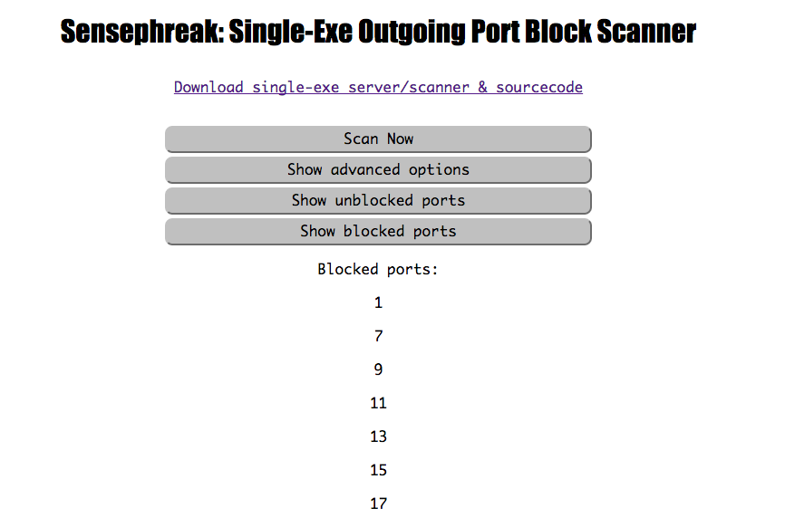

# Sensesphreak: single-exe outgoing port block scanner

Sensephreak is a single-exe outgoint port block scanner for the web.

It should be considered beta software at this stage.

After running an example server command, visit the server in your browser.

[Try a demo](https://outport.me)

## How to install from source

The following command will install sensephreak and dependencies, assuming you
have the Go compiler installed, and your `$GOPATH/bin` in your `$PATH`.

				$ go get -u github.com/jteeuwen/go-bindata && \
					go get -u github.com/gopherjs/gopherjs && \
					go get -u honnef.co/go/js/xhr && \
					go get -u -d github.com/johnny-morrice/sensephreak && \
					go generate github.com/johnny-morrice/sensephreak/... && \
					go install github.com/johnny-morrice/sensephreak

## Examples:

        # Default runs on localhost for safety (although this is unlikely to be useful
        # in production.)
        $ sensephreak serve

        # Listen on all ports.
        $ sensephreak serve --bind 0.0.0.0 --hostname yoursite.com

        # Command line scanner
        $ sensephreak scan --remote yoursite.com

## Recommendations

* Since this listens on every port, you probably want to run it in a VM (for base debian: `apt-get remove rpcbind`).
* You will need to increase the maximum number of open file descriptors with `/etc/security/limits.conf` and `ulimit`.
* Docker currently has a defect where exposing thousands of ports uses an astronomical amount of memory.
* Don't open the browser devtools `Network` tab while scanning.

## Credits

John Morrice

[github](https://github.com/johnny-morrice/)

[homepage](http://jmorrice.teoma.io)
